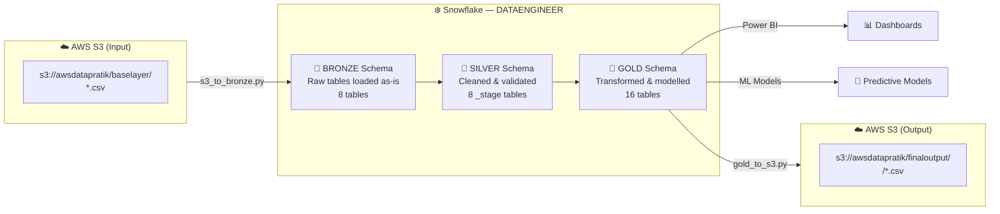
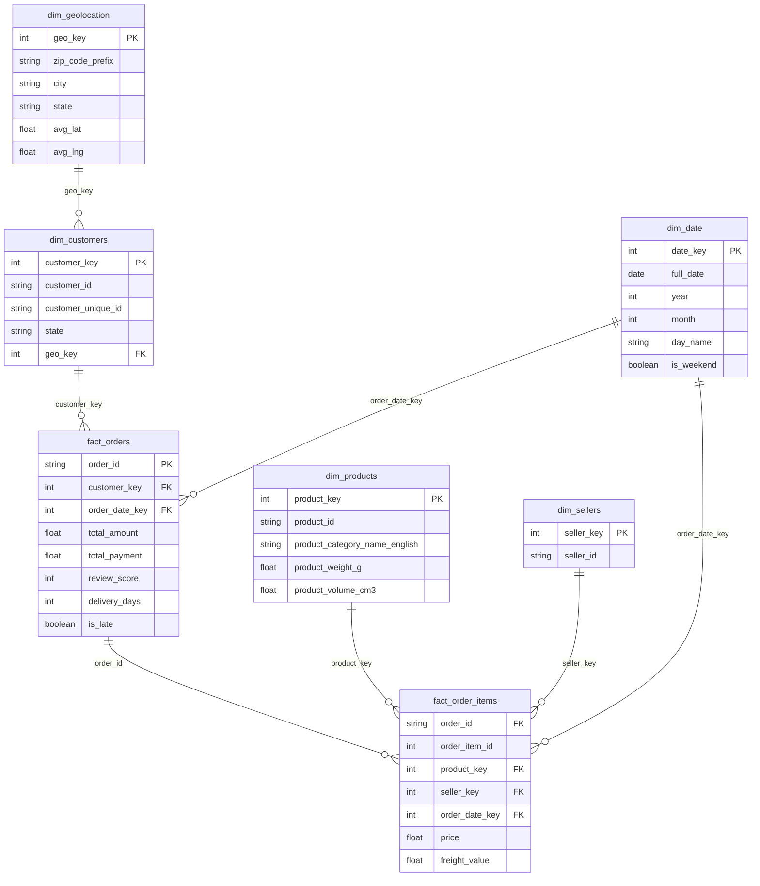

# Olist E-Commerce Data Pipeline


> End-to-end data engineering pipeline for the Brazilian Olist E-Commerce dataset.
> Ingests raw CSVs from S3, applies a **Bronze → Silver → Gold** medallion architecture in Snowflake,
> and exports the final Gold layer back to S3 — ready for Power BI dashboards and ML model training.

---

## Table of Contents

- [Architecture](#architecture)
- [Tech Stack](#tech-stack)
- [Project Structure](#project-structure)
- [Data Pipeline Layers](#data-pipeline-layers)
- [Gold Layer — Data Model](#gold-layer--data-model)
- [Setup](#setup)
- [Running the Pipeline](#running-the-pipeline)
- [Docker](#docker)
- [Data Quality](#data-quality)

---

## Architecture



---

## Tech Stack

| Layer | Technology |
|---|---|
| Storage (Raw & Output) | AWS S3 |
| Data Warehouse | Snowflake |
| Orchestration | Python scripts + Docker Compose |
| Containerisation | Docker |
| BI / Reporting | Power BI |
| Language | Python 3.11 |

---

## Project Structure

```
Dataengineer/
├── Dockerfile
├── docker-compose.yml
├── .env                                  # credentials (not committed)
├── .gitignore
│
├── data_ingestion/
│   ├── s3_to_bronze.py                   # S3 → Snowflake BRONZE
│   ├── bronze_to_silver.py               # BRONZE → SILVER (remove bad records)
│   ├── silver_to_gold.py                 # SILVER → GOLD (transform & model)
│   ├── gold_to_s3.py                     # GOLD → S3 export
│   ├── data_cleaning.py                  # Flag & cap outliers (BRONZE _clean tables)
│   ├── quality_checks.py                 # QC checks on BRONZE tables
│   ├── send_report.py                    # Email report — data cleaning summary
│   ├── send_silver_report.py             # Email report — Bronze→Silver summary
│   └── requirements.txt
│
└── Inputdata/                            # Source CSVs (local reference)
    ├── olist_customers_dataset.csv
    ├── olist_orders_dataset.csv
    ├── olist_order_items_dataset.csv
    ├── olist_order_payments_dataset.csv
    ├── olist_order_reviews_dataset.csv
    ├── olist_products_dataset.csv
    ├── olist_geolocation_dataset.csv
    └── product_category_name_translation.csv
```

---

## Data Pipeline Layers

### 🥉 Bronze — Raw Ingestion

Loads all 8 source CSVs from S3 into Snowflake **as-is** with no transformations.
Handles encoding (`ISO-8859-1`), timestamp formats, and file tracking for incremental loads.

| Table | Rows |
|---|---|
| olist_customers | 99,441 |
| olist_geolocation | 1,000,163 |
| olist_order_items | 112,650 |
| olist_order_payments | 103,886 |
| olist_order_reviews | 99,224 |
| olist_orders | 99,441 |
| olist_products | 32,951 |
| product_category_name_translation | 71 |

**Incremental load:** run `s3_to_bronze.py` normally to skip already-loaded files.
Use `--full-refresh` to drop and reload from scratch.

---

### 🥈 Silver — Cleaned & Validated

Removes invalid records from Bronze and writes clean `_stage` tables.
Referential integrity is cascaded — removing a parent row removes orphaned children.

| Issue | Action | Rows Removed |
|---|---|---|
| Duplicate `review_id` | Keep most complete row | 814 |
| `payment_value <= 0` | Remove (invalid payments) | 9 |
| `payment_installments < 1` | Remove | 2 |
| Date sequence violations in orders | Remove entire order row | 1,382 |
| Price / freight outliers (IQR) | Remove from order_items | ~17,558 |
| Payment value outliers (IQR) | Remove | ~7,981 |
| Product dimension outliers (IQR) | Remove | ~5,968 |

**25 / 25 quality checks pass** on all Silver tables after cleaning.

---

### 🥇 Gold — Transformed & Modelled

Star schema + aggregations + ML feature stores. All dim tables carry surrogate integer PKs
and declared FKs so Power BI auto-detects relationships.

| Category | Tables |
|---|---|
| Dimensions | `dim_date`, `dim_geolocation`, `dim_customers`, `dim_sellers`, `dim_products` |
| Facts | `fact_orders`, `fact_order_items` |
| Aggregates | `agg_revenue_by_category`, `agg_revenue_by_state`, `agg_seller_performance`, `agg_customer_cohorts` |
| ML Features | `ml_customer_features`, `ml_seller_features`, `ml_delivery_features`, `ml_review_features` |
| Master | `master_table` (108,841 rows — fully denormalized, one row per order-item) |

---

## Gold Layer — Data Model



---

## Setup

### Prerequisites

- Python 3.11+
- Docker Desktop
- Snowflake account
- AWS S3 bucket with source CSVs uploaded

### Environment Variables

Create a `.env` file in the project root:

```env
# Snowflake
SNOWFLAKE_USER=<your_user>
SNOWFLAKE_PASSWORD=<your_password>
SNOWFLAKE_ACCOUNT=<your_account>
SNOWFLAKE_WAREHOUSE=<your_warehouse>
SNOWFLAKE_DATABASE=<your_database>
SNOWFLAKE_SCHEMA=BRONZE

# AWS S3
AWS_KEY_ID=<your_access_key>
AWS_SECRET_KEY=<your_secret_key>
S3_BUCKET=<your_bucket>
S3_PATH=baselayer/

# Email (Gmail App Password)
EMAIL_SENDER=<your_gmail>@gmail.com
EMAIL_PASSWORD=<your_app_password>
SMTP_HOST=smtp.gmail.com
SMTP_PORT=587
```

### Install dependencies locally

```bash
pip install -r data_ingestion/requirements.txt
```

---

## Running the Pipeline

### Local (Python)

```bash
# 1. Ingest raw CSVs from S3 into Snowflake BRONZE
python data_ingestion/s3_to_bronze.py

# 2. Run quality checks on BRONZE
python data_ingestion/quality_checks.py

# 3. Clean BRONZE data (flag & cap outliers)
python data_ingestion/data_cleaning.py

# 4. Promote clean data to SILVER (remove bad records)
python data_ingestion/bronze_to_silver.py

# 5. Build GOLD layer (star schema + ML features)
python data_ingestion/silver_to_gold.py

# 6. Export GOLD tables back to S3
python data_ingestion/gold_to_s3.py

# 7. Send email reports
python data_ingestion/send_report.py
python data_ingestion/send_silver_report.py
```

For a full refresh (drop and reload everything):

```bash
python data_ingestion/s3_to_bronze.py --full-refresh
```

---

## Docker

### Build the image

```bash
docker build -t olist-pipeline .
```

### Run individual stages

```bash
docker-compose run s3_to_bronze
docker-compose run bronze_to_silver
docker-compose run silver_to_gold
docker-compose run gold_to_s3
```

### Run full pipeline end to end

```bash
docker-compose run s3_to_bronze && \
docker-compose run bronze_to_silver && \
docker-compose run data_cleaning && \
docker-compose run silver_to_gold && \
docker-compose run gold_to_s3 && \
docker-compose run send_report
```

> **Note:** Credentials are injected at runtime via `.env` — they are never baked into the image.

---

## Data Quality

Quality checks are run automatically as part of `bronze_to_silver.py` and reported to the console.
A full HTML report can also be emailed after each run.

| Check Type | Count | Result |
|---|---|---|
| Null checks on key columns | 8 | ✅ All pass |
| Duplicate PK checks | 5 | ✅ All pass (after Silver cleaning) |
| Referential integrity | 5 | ✅ All pass (after Silver cleaning) |
| Value range checks | 5 | ✅ All pass |
| Date sequence checks | 2 | ✅ All pass |
| **Total** | **25** | **25 / 25 PASS** |

---

## Author

**Pratik Shendarkar**
Data Engineer | Rutgers University
[ps1424@scarletmail.rutgers.edu](mailto:ps1424@scarletmail.rutgers.edu)
